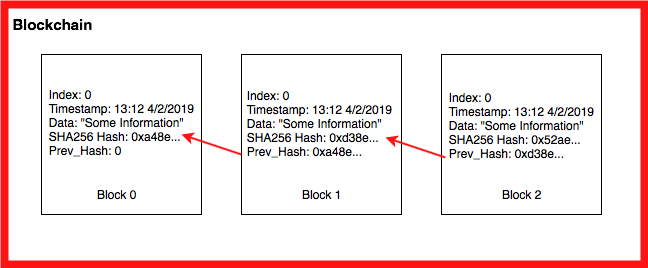

### Blockchain

A Blockchain is a sequential chain of records, similar to a linked list. Each block contains some information and how it is connected related to the other blocks in the chain. Each block contains a cryptographic hash of the previous block, a timestamp, and transaction data. For our blockchain we will be using a SHA-256 hash, the Greenwich Mean Time when the block was created, and text strings as the data. 



- I learnt to implement linked list in python through this problem.
- Create a list of data, you need to store in blockchain.
- Pass the list to ```create_blockchain()``` function.
- **Time Complexity** of creating while Blockchain: O(n), where n is the number of total blocks.

